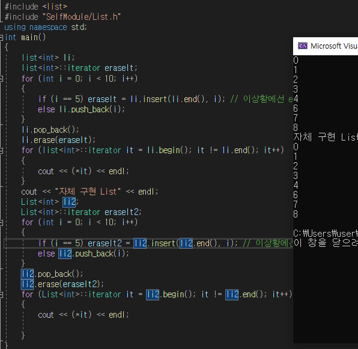

# 게임 프로그래밍 공부 - 1단계 알고리즘 공부

- [게임 프로그래밍 공부 - 1단계 알고리즘 공부](#게임-프로그래밍-공부---1단계-알고리즘-공부)
  - [1.프로젝트 준비](#1프로젝트-준비)
    - [1. 오른손의 법칙](#1-오른손의-법칙)
  - [2. 선형자료 기초](#2-선형자료-기초)
    - [특징](#특징)
      - [2-1.동적배열 구현하기.](#2-1동적배열-구현하기)
      - [2-2. 연결리스트 구현하기.(양방향)](#2-2-연결리스트-구현하기양방향)
      - [2-3. 스택 구현하기](#2-3-스택-구현하기)
      - [2-4. 큐 구현하기](#2-4-큐-구현하기)
      - [2-5. 오른손의 법칙 개선하기](#2-5-오른손의-법칙-개선하기)
  - [그래프 기초](#그래프-기초)
    - [3 - 1. 그래프 특징 및 구현](#3---1-그래프-특징-및-구현)
      - [통째로 관리하는 방법](#통째로-관리하는-방법)
      - [연결된 목록을 따로 관리하는 방법](#연결된-목록을-따로-관리하는-방법)
      - [행렬을 이용해 관리하는 방법](#행렬을-이용해-관리하는-방법)
      - [가중치가 있는그래프](#가중치가-있는그래프)
    - [3-2. DFS(깊이 우선 탐색, Depth First Search) 구현하기](#3-2-dfs깊이-우선-탐색-depth-first-search-구현하기)
    - [3-3. BFS(너비 우선 탐색, Breath First Search) 구현하기](#3-3-bfs너비-우선-탐색-breath-first-search-구현하기)
    - [3-4. BFS를 이용한 길찾기 구현.](#3-4-bfs를-이용한-길찾기-구현)
    - [3-5. 다익스트라 알고리즘](#3-5-다익스트라-알고리즘)
  - [4.힙과 우선순위 큐](#4힙과-우선순위-큐)
    - [4 -1 트리 기초](#4--1-트리-기초)
      - [4-1-1 트리 생성](#4-1-1-트리-생성)
      - [4-1-2 트리 출력](#4-1-2-트리-출력)
    - [4-2 힙트리 이론](#4-2-힙트리-이론)
      - [이진트리(이진검색트리)란?](#이진트리이진검색트리란)
      - [힙트리 란?](#힙트리-란)
    - [4-3 우선순위 큐 구현하기.](#4-3-우선순위-큐-구현하기)
    - [4-4 A\* 알고리즘 구현하기](#4-4-a-알고리즘-구현하기)
  - [5. 탐색트리](#5-탐색트리)
    - [5-1. 이진탐색 구현하기](#5-1-이진탐색-구현하기)
    - [5-2. 이진탐색트리 구현하기](#5-2-이진탐색트리-구현하기)
    - [5-3. 레드 블랙 트리 구현하기](#5-3-레드-블랙-트리-구현하기)
      - [5-3-1 레드 블랙 트리의 삽입](#5-3-1-레드-블랙-트리의-삽입)
  - [6. 정렬](#6-정렬)
    - [6 - 1.버블정렬](#6---1버블정렬)
    - [6 - 2.선택정렬](#6---2선택정렬)
    - [6-3.삽입정렬](#6-3삽입정렬)
    - [6-4.힙정렬](#6-4힙정렬)
    - [6-5.병합정렬](#6-5병합정렬)
    - [6-6.퀵정렬](#6-6퀵정렬)
  - [7. 해시테이블](#7-해시테이블)
    - [7-1. map vs hash_map](#7-1-map-vs-hash_map)
    - [7-2.해시와 테이블](#7-2해시와-테이블)
    - [7-3. 해시테이블의 충돌](#7-3-해시테이블의-충돌)
  - [8. 최소 패스닝 트리](#8최소-스패닝-트리)
    - [8-1. DisjointSet](#8-1disjoint-set) 
    - [8-2. 최소신장트리(Minimum Spanning Tree)](#8-2-최소신장트리minimum-spannig-tree)	 
    - [8-3. kruskal MST 알고리즘](#8-3-크루스칼Kruskal-MST-알고리즘)

-[햇갈릴 만한것 Review](#햇갈릴-만한것-review)

- [1. 전위/후위 연산자 오버로딩](#1-전위후위연산자-오버로딩)
- [2. vector의 resize vs reserve](#2-vector의-resize-vs-reserve)
- [3. shared_ptr](#3-shared_ptr)
- [4. NULL 은 0 이다](#4-NULL-은-0이다)

## 1.프로젝트 준비

_여기서 생성한 미로는 당장은 아니고, 추후 길찾기 알고리즘을 위해 미리 생성_

- ConsoleHelper.h, ConsoleHelper.cpp : 콘솔의 커서 조정 및 색을 입혀주기 위한 클래스로 굳이 외울필요는 없다. 한번 세팅하면 다시 안돌아봄.

- Board.h, Board.cpp : 길찾기 알고리즘을 위해서 미로를 만들어 줘야하는데, 미로를 만드는 코드들이다. 미로는 Binary Tree 미로생성 알고리즘을 통해 제작한다.

  - 바이너리 트리 미로 생성: (x % 2 == 0) || (y % 2 == 0) 을 통해 벽을 설정해주면 대부분이 벽으로 막혀있는데 열려있는 점들을 순회하며 위, 아래로 랜덤하게 길을 뚫어주는것.

- pch.h : 미리 컴파일된 헤더로, 컴파일 시간을 단축하기 위해서 사용한다. 추후 좌표값 계산을 편하게 하기위한 연산자 오버라이딩도 구현되어있다.

- Player.h, Player.cpp : 캐릭터 이동관련. 실질적인 길찾기 알고리즘은 player클래스의 Update문에서 담당할것이다.

  ### 1. 오른손의 법칙

  알고리즘이라 하긴 뭐하지만 미로탈출중 가장 대표적인 방법이다.

로직

1. 현재 바라보는 방향을 기준으로 오른쪽으로 갈 수 있는지 확인한다
   1-1. 참일시, 오른쪽 방향으로 90도 회전 후 한 보전진
   1-2. 거짓일시 2번으로.
2. 현재 바라보는 방향 기준으로 전진할 수 있는지 확인.
   2-1. 참일시 앞으로 한보 전진.
   2-2. 거짓일시 3번으로.
3. 왼쪽으로 90도 회전,
4. 이후 무한 루프.

구현된 코드는 [./Maze/Player.cpp](./Maze/Player.cpp) 의 RightHandOnWall함수에서 확인 할 수 있으며 결과는 다음과 같다.  


## 2. 선형자료 기초

Chapter2 에서 구현한 대부분의 자료구조는 [./Algorithm/Selfmodule](./Algorithm/Selfmodule)에 저장된다.  
구현에만 집중하고 헤더파일 분리는 나중에 시간나면 제대루,,,

### 특징

대표적으로 배열, 동적배열, 연결리스트가 있음
대표적인 특징만 알아보자면

- 배열 : 배열은 정해진 크기에서 축소, 확대할 수 없음. 연속되어있다는 것은 장점이 될수 있지만, 아무래도 확대, 축소가 불가능한것은 단점이 된다.

- 동적 배열 : 동적배열은 사용할 배열의 크기를 유동적으로 조절이 가능하다. 연속된 방을 사용하는것은 똑같지만, 가득 찰경우 아예 다른 주소에서 연속된 값을 가져온다.
  또한 가득 차서 이동시 capacity에 여유분을 준다. (보통 capacity + capacity / 2) 로 추후 가면 안정적으로 사용 가능. 중간 삽입 삭제시 이전에 값을 당겨야하는 경우가 있어,
  중간 삽입 삭제에 비효율 적이다.

- 연결 리스트 : 연속되지 않은 형태, 한 노드가 다른노드를 지정하는 식이라 간 삽입 삭제에 이점을 보이지만 임의접근 Random Access가 불가능하다.

  #### 2-1.동적배열 구현하기.

  동적배열은 기존에 vector로 구현이 되어있지만, 연습 겸 구현해 보았다.  
  구현된 벡터 클래스는 **[여기](./Algorithm/SelfModule/Vector.h)** 를 클릭하면 볼 수 있다.  
  capacity는 배열의 잦은 이주를 방지하기 위해 미리 공간을 선점해 두는 것으로 이전 크기의 \* 1.5 를 채택했다.  
  그밖에 reserve, size, clear, push_back 등 기존에 있던 vector클래스와 같이 구현했다.  
  아래 이미지는 기존에 vector와 구현한 Vector클래스의 비교이다.  
  

#### 2-2. 연결리스트 구현하기.(양방향)

연결리스트는 기존에 list로 구현이 되어있지만, 연습 겸 구현해 보았다.
구현된 리스트 클래스는 **[여기](./Algorithm/SelfModule/List.h)** 를 클릭하면 볼 수 있다.  
리스트 내부의 하나하나 요소를 구성하는 Node와,  
추후 배회할때 필요한 Iterator,  
Node들을 전체로 포함하는 List 클래스들로 구성을 했다.
아래 이미지는 기존에 list와 구현한 List클래스의 비교이다.  


#### 2-3. 스택 구현하기

스택은 LIFO(Last In First Out) 형태의 자료구조로, 웹페이지 뒤로가기, ctrl+z 등과 같이 여러군대에 쓰이는 자료구조이다.  
구현된 스택 클래스는 **[여기](./Algorithm/SelfModule/Stack.h)** 를 클릭하면 볼 수 있다.  
사실 스택은 여러가지 형태로 구현할 수 있다. 배열, 동적배열, 연결리스트 등 다양하지만 여기선 Node에 전에 들어온 주소값을 넣어 관리하는  
연결리스트 형태로 구현하였다.  
아래 이미지는 기존 스택과 구현한 Stack클래스의 비교이다.


#### 2-4. 큐 구현하기

큐는 FIFO(First In First Out), 즉 선입선출의 방식으로 작동한다. Stack보다 활용도가 높은 알고리즘으로 대표적으로 대기열에서 사용한다.  
단방향인 그냥 Queue 와 양방향인 deque 가 있다. 일단 여기선 단방향인 queue를 구현한다.  
구현된 큐 클래스는 **[여기](./Algorithm/SelfModule/Queue.h)** 를 클릭하면 볼 수 있다.
큐 또한 여러가지 방법으로 구현 가능하지만, 배열을 이용해 순환구조를 만들어 구현해본다. 즉 시작과 끝을 알고있어 index를 조정해가며 구현하는 queue이다.  
기존에 동적배열은 이미 구현해봤으므로, vector함수를 사용해 구현했다. 이런식으로 구현하면 동적배열의 단점이었던 중간 삽입삭제 시 O(n)의 시간복잡도를 갖는다는
문제를 해결 할 수 있다.  
아래 이미지는 기존 큐와 구현한 Queue클래스의 비교이다.  


#### 2-5. 오른손의 법칙 개선하기

위에서 배운 stack으로 오른손의 법칙을 개선할 수 있다. 기존에 진행 할 경로를 \_path에 저장해 두었는데, 이를 순회하며 반복되는 경로가 있을시
pop을 해주면 결과적으로는 바로 출구쪽으로 직행하게 될것이다.개선된 코드는 **[여기](./Maze/Player.cpp)**의 RightHandOnWall함수에서 볼 수 있다.

```cpp
//...(생략)
stack<Pos> s;
for (int i = 0; i < _path.size() - 1; i++)
{
    if (s.empty() == false && s.top() == _path[i + 1])
    {
        s.pop();
    }
    else s.push(_path[i]);
}
```

이렇게 pop 될떄마다 stack의 top이 \_path[i+1]와 맞물려(즉 현재 기준으로 전후이니, pop될시 이 \_path[i-n] & \_path[i+n] 끼리 비교하는것과 다름없다.) 겹친경로는 다 사라지게 된다.
결과는 아래와 같다. 확실히 개선이 된것을 볼 수 있다.  


## 그래프 기초

### 3 - 1. 그래프 특징 및 구현

그래프는 현실 세계의 사물이나 추상적인 개념간의 연결관계를 표현한다.

- 정점(Vertex) : 데이터를 표현(사물, 개념 등)

- 간선(Edge) : 정점들을 연결하는데 사용.

도로망, 소셜 네트워크 관계도, 지하철 노선도 등에서 사용한다.

그래프에는 각 간선에 가중치를 부여한 **가중치 그래프**, 간선에 방향이 있는 **방향그래프** 가 있다.

다음 그래프를 코드로 4가지 방법으로 구현해보자.(방향그래프)

1. 통째로 관리
2. 연결된 목록을 따로 관리
3. 행렬을 이용해 관리
4. 가중치가 있는 그래프


##### 통째로 관리하는 방법

```cpp
struct Vertex
{
    vector<Vectex*> edges;
    int data;
}
vector<Vertex> v;
v.resize(6);
v[0].edges.push_back(&v[1])
v[0].edges.push_back(&v[3])
v[1].edges.push_back(&v[0])
v[1].edges.push_back(&v[2])
v[1].edges.push_back(&v[3])
v[3].edges.push_back(&v[4])
v[5].edges.push_back(&v[4])
```

##### 연결된 목록을 따로 관리하는 방법

```cpp
vector<vector<int>> adjacent(6);
adjacent[0] = {1,3};
adjacent[1] = {1,3};
adjacent[3] = {4};
adjacent[5] = {4};
```

간선들이 비교적 적은 문제에서 많이 사용하는 방법이다.

##### 행렬을 이용해 관리하는 방법

adjacant[from][to] 로 읽으면 된다. 즉 adjacent[0][1] 면 0 -> 1

```cpp
vector<vector<bool>> adjacent(6, vector<bool>(6,false));
adjacent[0][1] = true;
adjacent[0][3] = true;
adjacent[1][0] = true;
adjacent[1][2] = true;
adjacent[1][3] = true;
adjacent[3][4] = true;
adjacent[5][4] = true;
```

행렬을 이용한 2차원 그래프 표현이다. 메모리 소모가 심하지만, 빠른 접근이 가능하다.(간선이 많은경우 이점이 있다.)

##### 가중치가 있는그래프

크게 다르지 않다. 당장에 2번 방식에 int 대신 pair을 써서 표현해도 되고(adjacent[0] = {std::pair(1,50)}같이), 3번에선 bool대신 int를 받아서 써도된다.  
간단하게 아래같이도 표현가능하다.

```cpp
vector<vector<int>> adjacent =
{
  vector<int> {-1,10,-1,50,-1,-1},
  vector<int> {15, -1, 5, 10, -1, -1},
  .......
}
```

같이 표현도 가능하다.

### 3-2. DFS(깊이 우선 탐색, Depth First Search) 구현하기

입구에서 깊은것부터 탐색하는 방법이다.  
구현한 DFS 해더파일 선언부는 **[여기(DFS.h)](./Algorithm/SelfModule/DFS.h)**를 클릭하면 볼 수 있고,  
DFS의 구현부는 **[여기(DFS.cpp)](/Algorithm/SelfModule/DFS.cpp)**를 클릭하면 볼 수 있다.  
연결된 목록을 따로 adjacent에서 관리해 재귀함수로 구현하였다.  
DFS 헤더파일 선언 후 **dfs.visit(시작노드)**를 지정하면 해당 노드부터 DFS를 진행하게 제작했다.  
만약 노드가 동떨어져 있으면(시작점에서 타고가도 연결되어 있지 않으면) DfsEtc를 호출하면 나머지 노드들을 찾아서 DFS를 진행한다.  
결과는 아래와 같다.  
</img>

### 3-3. BFS(너비 우선 탐색, Breath First Search) 구현하기

DFS와는 다르게 가까운 노드부터 방문한다는게 특징이다.  
구현한 DFS 해더파일 선언부는 **[여기(BFS.h)](./Algorithm/SelfModule/BFS.h)**를 클릭하면 볼 수 있고,  
DFS의 구현부는 **[여기(BFS.cpp)](/Algorithm/SelfModule/BFS.cpp)**를 클릭하면 볼 수 있다.  
연결된 정점들은 무한루프를 통해서 탐색한다.  
BFS 헤더파일 선언후 **bfs.visit(시작노드)**를 지정하면 해당 노드부터 BFS를 진행하게 제작했다.  
만약 노드가 동떨어져 있으면(시작점에서 타고가도 연결되어 있지 않으면) discoverAll를 호출하면 나머지 노드들을 찾아서 BFS를 진행한다.  
결과는 아래와 같다.  


### 3-4. BFS를 이용한 길찾기 구현.

위에서 했던 우수법(오른손의 법칙)은 길을 찾긴 하진만 최단경로를 보장하지 못할 뿐더러, 미로가 복잡할 경우 길을 찾지 못하는 경우도 있다.  
BFS를 사용하면 최단경로가 보장이 된다. 또한 방금 학습했던 BFS는 인접노드와, 정점들의 정보를 따로 입력해줘야했지만, 미로에서는 맵의 구조를 안다면 그래프로 표현이 가능하다.  
구현 알고리즘은 다음과 같다.

>     bfs
>     1. 처음 방문한 곳을 큐에 넣어주고 발견 check,
>     2. 무한 루프를 돌면서 순회한다. 상하좌우 갈 수 있나 체크
>     2-1. 갈 수 없으면 continue.
>     2-2. 이미 발견한 지역이면 continue.
>     3. bfs순회 후 도착했으면 break 하고 parent를 역참조 하여 간다.
>
> 구현된 코드는 [./Maze/Player.cpp](./Maze/Player.cpp) 의 Bfs함수에서 확인 할 수 있으며 결과는 다음과 같다.  
> 

### 3-5. 다익스트라 알고리즘

위에서 BFS는 길찾기를 사용할때 각 간선들이 동일한 비용을 갖고 있다고 가정해 만드는데 큰 문제는 없었다.  
아래 이미지처럼 간선마다 비용(가중치, 거리)들이 붙기 시작한다면 다른 알고리즘을 알아봐야한다.  
  
이 이미지에서 가장 0번에서 4번까지 가는 가장 저코스트의 경로는 0->1->3->4 이다.

1. 출발노드 설정후 최소비용 저장.
2. 이동하고 그 다음 노드까지 이동하는 비용과, 이전에 있던 cost값 비교 후 작은값을 넣어준다.(갱신)
3. 반복
   위와같은 순서대로 구현해줄 것이다.

구현한 다익스트라 해더파일 선언부는 **[여기(Dijkstra.h)](./Algorithm/SelfModule/Dijkstra.h)**를 클릭하면 볼 수 있고,  
다익스트라의 구현부는 **[여기(Dijkstra.cpp)](/Algorithm/SelfModule/Dijkstra.cpp)**를 클릭하면 볼 수 있다.  
구현된 결과는 다음과 같다.  


## 4.힙과 우선순위 큐

### 4 -1 트리 기초

트리란 계층적 구조를 갖는 데이터를 표현하기 위한 자료구조이다

- 노드(Node): 데이터를 표현

- 간선(Edge): 노드의 계층구조를 표현하기 위해 사용

#### 4-1-1 트리 생성

트리는 아래와 같이 생성 할 수 있다.

```cpp
using NodeRef = std::shared_ptr<struct Node>;
struct Node
{
    Node(const string& data) : data(data) {}

    string data;
    vector<NodeRef> children;
};

NodeRef CreateTree()
{
    NodeRef root = make_shared<Node>("루트");
    {
        NodeRef node = make_shared<Node>("요소 1");
        root->children.push_back(node);
        {
            NodeRef leaf = make_shared<Node>("리프1");
            node->children.push_back(leaf);
        }
....(생략)
}
```

#### 4-1-2 트리 출력

호출은 재귀함수를 이용하면 된다.

```cpp
void PrintTree(NodeRef root, int depth)
{
    for (int i = 0; i < depth; i++) cout << "-";
    cout << root->data << endl;
    for (NodeRef& child : root->children)
        PrintTree(child,depth + 1);
}
```

Tree에 대한 예시코드는 [여기(TreeExam.cpp)](./Algorithm/SelfModule/TreeExam.cpp)를 클릭하면 되고, 결과는 아래같이 나온다.


### 4-2 힙트리 이론

#### 이진트리(이진검색트리)란?

이진트리는 각 노드가 최대 두개의 자식을 가지는 트리이다.  
이진검색트리는 왼쪽은 현재값보다 작고, 오른쪽은 현재값보다 무조건 큰 트리의 구조를 의미한다. 이진트리를 효율적으로 구현하기 위해서는 이진트리의 균형을 맞추어주어야 하는데, 이를위해 AVL,Red-Black을 사용한다.

#### 힙트리 란?

힙트리는 완전이진트리의 일종으로 우선순위 큐를 구현하기 위한 트리이다. 다만 느슨한 정렬을 이루게된다.(상위노드가 하위노드보다 크다는 정도만)힙트리는 다음과 같은 법칙을 따른다.

- [부모 노드]가 가진값은 항상 [자식노드] 보다 크다.

- 노드의 개수를 알면 트리 구조는 무조건 확정할 수 있다. (마지막 레벨을 제외한 모든 레벨은 채워져 있어야한다. 채울때는 왼쪽부터 채워야한다.) 이는 배열을 이용해서 힙 구조를 바로 표현할 수 있다는 것을 의미한다.  
  (루트는 A[0], i번 노드의 왼쪽자식은 [(2*i) + 1], i번 노드의 오른쪽 자식은 [(2*i) + 2], i 번 노드의 부모는 [(i-1)/2] 이다.)

### 4-3 우선순위 큐 구현하기.

우선순위 큐는 template 형태로 구현했으며 총 3개의 인자까지 받을 수 있다.  
Priority_queue<자료형, Container, Predicate> 형식으로 넣어줄 수 있으며 Predicate는 정렬방식을 넣어준다 (std::greater, std::less)  
간단하게 알고리즘을 설명하자면 push할땐 맨 밑에 넣어주고 (i - 1) / 2 와 크기를 계속비교해주고 Predicate 조건에 맞으면 멈춘다.
pop은 A[0]를 삭제하고 끝노드를 올린후, 좌측과비교, 우측과 비교후 Predicate조건에 맞으면 멈춘다.
Priority_queue 에 대한 예시코드는 [여기(Priority_queue)](./Algorithm/SelfModule/Priority_queue.h)를 클릭하면 되고, 결과는 아래같이 나온다.  


### 4-4 A\* 알고리즘 구현하기

A\*알고리즘은 최종점수(F)를 기준으로 가장빠른 경로를 찾는 알고리즘이다.

**F=G+H** 를 기반으로 최단거리를 찾는데, **G** 는 **시작점에서 해당좌표까지 이동하는데 드는 비용**이고, **H**는 **목적지에 얼마나 가까운지 나타내는 것이다**

즉 보통 F값이 작을수록 좋은것이며, 이를 구현하기 위해 priority_queue를 사용한다(보통predicate를 greater로 둬서 오름차순으로 정렬). 이를 제외하면 전체적인 알고리즘은 다익스트라와 똑같다. 구현한 코드는 [여기(Player.cpp)](./Maze/Player.cpp) 에 AStar() ,함수에 있으며 구현 결과는 아래와 같다

 크기 설정")

## 5. 탐색트리

### 5-1. 이진탐색 구현하기

정렬이 된 배열등에서 데이터를 탐색하는 방법이다. 중간에 있는 데이터를 기준으로 up/down을 책정하고, true인 부분을 또한 같은방법으로 비교하는 방법이다. 일반적인 탐색은 O(n) 이지만, 이진탐색은 O(logn)이 나온다.

구현한 코드는 [여기(BinarySearch.h)](./Algorithm/BinarySearch.h) 에 있으며, 결과는 아래와 같다.

 크기 설정")

### 5-2. 이진탐색트리 구현하기

위에서 이진탐색을 보았지만, 이진탐색은 배열의 단점을 보완하지 못해 삽입, 삭제등에 시간이 오래걸린다는 단점이 있다. 이를 트리형태로 만들어서 보완한것이 이진 탐색 트리이다.  
구현은 Insert, Search, Next(다음으로 큰값 찾기), Min, Max, Delete, Print(Inorder 혹은 트리형탸로)를 구현하였다.
알고리즘적으로 레드블랙 트리를 들어가기전 매우 중요한 부분이라 코드를 한번 복기하고 넘어가보자.

- Insert는 간단하게 값이 크면 node->right, 값이 작으면 node->left로 넣어주었고,
- Search는 이진탐색과 마찬가지로 크면 right, 작으면 left를 탐색해 시간복잡도를 O(logn)으로 맞춰주었다. ([구현한 코드](./Algorithm/SelfModule/BinarySearchTree.h)내에 Search, Search2 두개가 있는데 Search는 재귀함수로 구현, Search2 는 while문으로 구현한 것이다.)
- Min 은 tree가 nullptr이 나올때까지 Node->left를 타고 내려가 마지막값을 return해준다
- Max 는 tree가 nullptr이 나올때까지 Node->right를 타고 내려가 마지막값을 return해준다.
- Delete는 다음 3가지를 고려해서 코드를 짰다.
  - child가 하나도 없는경우-> 날려주고 끝
  - 자식이 하나만 있는경우, 자식을 위로 올려주고 자기자신은 삭제
  - 자식이 두명인경우 -> 자기보다 다음으로 큰 수를 찾아서 넣어주고, 중복된 수는 삭제해준다.
- Search는 Inorder와 트리구조로 Print해주는것을 제작했다. Inorder는 left,right를 탐색하기전 출력을 맨위에 해주면 된다.(이후 Preorder, postorder도 출력순서만 바꾸어주면됨) 트리구조로 출력은 그냥 CursorPosition조정해주면서 크기 조정해주며 만들었다.

구현한 이진탐색트리 선언부는 **[여기(BinarySearchTree.h)](./Algorithm/SelfModule/BinarySearchTree.h)**를 클릭하면 볼 수 있고,  
이진탐색트리의 구현부는 **[여기(BinarySearchTree.cpp)](/Algorithm/SelfModule/BinarySearchTree.cpp)**를 클릭하면 볼 수 있다.

결과는 아래와 같다.

 크기 설정")

### 5-3. 레드 블랙 트리 구현하기

이진탐색트리는 균형이 한쪽으로 쏠리면 일반 배열과 다를게 없다는 단점이 있다. 이러한 단점을 해결하기 위해 트리의 균형을 맞추는 여러가지 방법이 있는데(AVL, Red-Black 등) 그 중 우리가 구현할 것은 Red-Black(레드 블랙) 트리이다. 이전에 다른 알고리즘에 비해서 조금 복잡해 내용이 좀 길다. 우선 레드블랙 트리의 특성은 다음과 같다

> 1. 노드는 레드 혹은 블랙 중의 하나이다.
> 2. 루트 노드는 블랙이다.
> 3. 모든 리프 노드들(NIL)은 블랙이다.
> 4. 레드 노드의 자식노드 양쪽은 언제나 모두 블랙이다. (즉, 레드 노드는 연달아 나타날 수 없으며, 블랙 노드만이 레드 노드의 부모 노드가 될 수 있다)
> 5. 어떤 노드로부터 시작되어 그에 속한 하위 리프 노드에 도달하는 모든 경로에는 리프 노드를 제외하면 모두 같은 개수의 블랙 노드가 있다.

#### 5-3-1 레드 블랙 트리의 삽입

일반적인 이진트리처럼 삽입하되, 레드 블랙트리의 조건에 맞아야 하므로 마지막에 InsertFixup이라는 함수를 통해 규칙을 맞추어준다.

Red-Red인 경우는 약 3가지의 케이스가 있다.

1. 부모(parent) 가 Red, 삼촌(uncle)이 red인 경우------------------

2. 부모(parent) 가 Red, 삼촌(uncle)이 black인데 triangle 형태일 경우  크기 설정")

3. 부모(parent) 가 Red, 삼촌(uncle)이 black인데 list형태일 경우

위 3가지 경우인데

**1번같은 경우엔** parent와 uncle을 black으로 바꾸어주고, 그 조상을 red로 바꾸어주는 recoloring을 해주면 된다.

**2-3번같은 경우엔** 오른쪽 회전 or 왼쪽 회전후 recoloring을 진행해주면 된다.

아래 구현 영상이 예시이다.

아래는 삽입을 구현한 gif이다. 터미널 창 특성상 파란색이 black트리이고, 빨간색이 red트리이다. 1,2,3 번 예시모두 나오므로 확인해보자.


## 6. 정렬

### 6 - 1.버블정렬

가장 기초가 되는 정렬로 자신의 옆에 있는값과 비교하여 값이 크거나 작으면(오름차순, 내림차순) 자리를 바꾸어준다. 그렇게 (N-1) + (N-2) .... + 2 번 교환이 일어나게 되고, 구현은 쉽지만 효율성은 O(n^2)이다. 아래는 버블정렬의 정렬과정을 그래프로 나타낸것이다.


```cpp
	const int n = (int)v.size(); // std::vector v{3,5,1,4,6,7}
	for (int i = 0; i < n - 1; i++)
	{
		for (int j = 0; j < (n - 1 - i); j++)
		{
			if (v[j] > v[j + 1])
			{
				std::swap(v[j], v[j + 1]);
			}

		}
	} // output : 1,3,4,5,6,7
```

간단하게 위처럼 구현이 가능하다.

### 6 - 2.선택정렬

리스트를 한바퀴 순회후, 가장 작은것을 골라서 앞에서 부터 채워준다. 간단히 아래 애니메이션 같은 형태를 따른다


똑같이 O(n^2) 이지만 성능상으로는 버블정렬보단 우수하다. (비교횟수는 동일하지만 이동횟수가 적음)

```cpp
	const int n = (int)v.size();
	for (int i = 0; i < n - 1; i++)
	{
		int bestIdx = i;
		for (int j= i + 1; j < n; j++)
		{
			if (v[j] < v[bestIdx]) bestIdx = j;
		}
		std::swap(v[i], v[bestIdx]);
	}
```

### 6-3.삽입정렬

배열의 모든 요소를 앞에서부터 차례대로 이미 정렬된 배열 부분과 비교하여, 자신의 위치를 찾아 삽입함으로써 정렬을 완성. 하지만 구현할때 구지 새 공간을 할당해줄 필요는 없음.**좌우로 분류를 해서 다른 공간처럼 사용하면 된다.**

```cpp
void Sort::InsertSort()
{
	const int n = (int)v.size();
	for (int i = 1; i < n; i++)
	{
		int insertData = v[i];
		int j;
		for (j = i - 1; j >= 0; j--)
		{
			if (v[j] > insertData) v[j + 1] = v[j];
			else break; //밀어주다가 적당한 위치 찾으면 break
		}
		v[j + 1] = insertData; // 그 적당한 위칭 insertData
	}
}
```

### 6-4.힙정렬

힙 정렬은 위에서 이진트리를 구현할때 많이 사용한 priority_queue를 사용하면 구현이 매우 간단하다.
알고리즘은 다음과 같다

1. n개의 노드에 대한 완전 이진 트리를 구성한다. 이때 루트 노드부터 부모노드, 왼쪽 자식노드, 오른쪽 자식노드 순으로 구성한다.
2. 최대 힙을 구성한다. 최대 힙이란 부모노드가 자식노드보다 큰 트리를 말하는데, 단말 노드를 자식노드로 가진 부모노드부터 구성하며 아래부터 루트까지 올라오며 순차적으로 만들어 갈 수 있다.
3. 가장 큰 수(루트에 위치)를 가장 작은 수와 교환한다.
4. 2와 3을 반복한다.  
   간단히 구현하자면 아래와 같다.

```cpp
void Sort::HeapSort()
{
	std::priority_queue<int, std::vector<int>, std::greater<int>> pq;
	for (int num : v)
		pq.push(num);
	v.clear();
	while (pq.empty() == false)
	{
		v.push_back(pq.top());
		pq.pop();
	}
}
```

이 힙정렬은 위에서 확인했던 3가지 정렬들보다 시간복잡도가 우월하다.  
우선순위 큐에서 push는 O(nlogn) pop또한 O(nlogn)의 시간복잡도를 가진다.  
즉 힙정렬또한 O(nlogn)의 시간복잡도를 가진다.

### 6-5.병합정렬

분할정복이라는 계념이 들어가게된다.

1. 분할(Divide) - 문제를 단순하게 분할
2. 정복(Conquer) - 분할된 문제를 해결
3. 결합(Combine) - 결과를 취합해 마무리  
   [3][5][1][9][2][6][4][8]을
   [3][5][1][9] | [2][6][4][8]로 나눠서 정렬한다. 이 또한  
   [3][5] | [1][9] | [2][6] | [4][8] ,  
   [3] | [5] | [1] | [9] | [2] | [6] | [4] | [8]  
   처럼 계속 나눈다.
   결합은 자기 옆의 숫자와 비교해 다시 결합한다.
   [3][5] | [1][9] | [2][6] | [4][8] #숫자를 적을땐 막 썻는데 이미 되어있네...?  
   [1][3][5][9] | [2][4][6][8]  
   **[1][2][3][4][5][6][8][9]**  
   가 최종 결과값이다.  
   시간복잡도는 O(NlogN)으로 빠른편이다.
   이를 코드로 옮기면 다음과 같다.

```cpp
void Sort::MergeResult(int left, int mid, int right)
{
	std::vector<int> result;
	int leftIdx = left;
	int rightIdx = mid + 1;
	while (leftIdx <= mid && rightIdx <= right)
	{
		if (v[leftIdx] <= v[rightIdx])
		{
			result.push_back(v[leftIdx]);
			leftIdx++;
		}
		else
		{
			result.push_back(v[rightIdx]);
			rightIdx++;
		}
	}

	if (leftIdx > mid)
	{
		while (rightIdx <= right)
		{
			result.push_back(v[rightIdx]);
			rightIdx++;
		}
	}
	else
	{
		while (leftIdx <= mid)
		{
			result.push_back(v[leftIdx]);
			leftIdx++;
		}
	}
	for (int i = 0; i < result.size(); i++)
	{
		v[left + i] = result[i];
	}
}

void Sort::MergeSort(int left, int right)
{
	if (left >= right)
		return;
	int mid = (left + right) / 2;
	MergeSort(left, mid);
	MergeSort(mid + 1, right);
	MergeResult(left,mid,right);
}
```

재귀함수로 구현하면 편하다.

### 6-6.퀵정렬

정렬알고리즘 중 가장 유명한 Quick Sort이다.  
병합 정렬처럼 데이터를 둘씩 쪼개서 하는것은 비슷해 보이지만(분할정복) , pivot을 설정해 비교해 나간다는 점이 큰 차이점이다.
  
앞으로 설명할 low 와 high는 pivot이 맨 왼쪽일때 pivot바로 오른쪽값이 low, 끝값이 high이다. 이 둘은 각각 ++,-- 해나가며 이동한다.

1. pivot >= arr[low] 일경우는 low를 오른쪽으로 이동 (++)
2. pivot <= arr[high] 일경우 high를 왼쪽으로 이동 (--)
3. 만약 low < high라면 arr[low]와 arr[high]를 교체
4. 1,2 를 반복하다가 low > high 라면 빠져나오고 pivot과 arr[high]를 교체 (이 과정을 완료하면 pivot의 위치가 정해지고, 왼쪽은 pivot보다 작고, 오른쪽은 pivot보다 크다)  
   이를 그림으로 표현하면 아래와 같다


위 과정을 재귀적으로 하면 완료된다.

```cpp

int Sort::partition(int left, int right)
{
	int pivot = v[left];
	int low = left + 1;
	int high = right;

	while (low <= high)
	{
		while (low <= right && pivot >= v[low])
		{
			low++;
		}
		while (high >= left + 1 && pivot <= v[high] )
		{
			high--;
		}
		if (low < high)
		{
			std::swap(v[low], v[high]);
		}
	}
	std::swap(v[left], v[high]);

	return high;
}
void Sort::QuickSort(int left, int right)
{
	if (left > right) return;
	int pivot = partition(left,right);
	QuickSort(left, pivot - 1);
	QuickSort(pivot + 1, right);
}
```

이중루프로 되어있어 O(N^2)인것 처럼 보이지만, high와 low가 전진하기때문에 O(N), Partition부분은 O(logN)이므로 사실상 O(NlogN)이다.
하지만 최악의 경우에는 pivot을 N번 호출해야할때도 있어 O(N^2)이 나오기도 한다.(pivot값이 치우친경우)  
Merge Sort, Heap Sort 와 같은 O(NlogN)이더라도, 데이터를 복사하는 비용을 고려하면 대부분의 상황에서 더 빠르게 작동한다.

> 구현된 정렬 코드들은 [Sort.cpp](/Algorithm/SelfModule/Sort.cpp) 에 다 모여있다.

## 7. 해시테이블

hash함수를 사용해서 변환한 값을 index(key) 로 삼아서 value를 저장하는것

### 7-1. map vs hash_map

hash_map은 C++11 표준에서 unordered_map 이다.

map : Red-Black Tree  
추가 탐색 삭제가 O(logN)의 시간복잡도를 가진다.

hash map(unordered map)
C#, python에 있는 Dictionary와 C++의 unordered_map은 같은 개념이다.
추가,삭제,탐색이 O(1)의 시간복잡도를 가진다. 간단히 말하자면 메모리 측면에선 손해를 보고, 속도면에선 이득을 본것이다.  
즉 키를 값에 매핑에 상수시간으로 값을 찾을 수 있다.

굳이 정렬된 데이터가 필요한게 아니라면 unordered map이 대부분의 상황에서 유리한것 같다. 아래 링크 참조  
http://supercomputingblog.com/windows/ordered-map-vs-unordered-map-a-performance-study/

### 7-2.해시와 테이블

해시와 테이블이란 단어를 분리해서 생각해보자. 먼저 **테이블**에 대해 알아보자
예시라 하기도 민망하지만 아래처럼 Table을 짤수 있다

```cpp
struct User
{
  int userId = 0; // 0~ 999
  string userName;
};

void testTable()
{
  vector<User> userList;
  userList.resize(1000);
  usersList[123] = {123, "Jisung"};
}
```

즉 테이블에선 키를 알면 데이터를 한번에 찾을 수 있다!  
하지만 데이터가 커질수록 저런 방법을 사용하면 , 메모리측면에서 비효율적이고 무한이 아니라 overflow가 날수밖에 없다.  
여기서 **해시**를 사용한다.  
보안측에서 자주등장하는 용어인 해시는 데이터를 다른값으로 만들어준다. 즉 입력 데이터를 고정된 길이의 데이터로 변환된 값이다.

```cpp
const int  userId = 1234546;
int key = (userId % 1000); // hash 알고리즘은 엄청 다양하다.
```

즉 해시 테이블은 테이블로 관리를 하되, 키의 해시값을 추출해서 테이블에 저장하는것이다. 즉 아래이미지가 요약이다.  


### 7-3. 해시테이블의 충돌

다른 키값에 해시함수를 적용했을때 동일한 키값이 나오면 이를 충돌이라 한다.

1. 충돌이 발생한 자리를 대신해서 다른 빈자리를 찾아나선다.

- 선형조사법 (linear probing) : hash(key) + 1-> hash(key)+ 2 처럼 1씩더해서 저장.
- 이차조사법 (quadratic probing) : hash(key) + 1^2 -> hash(key) + 2 ^ 2 처럼 좀더 분산시켜 저장

2. 체이닝을 하는것. 즉 동일한 키값이 있으면 다른 키값을 찾아주는것이 아닌 연결리스트처럼 한 키에 여러개를 저장
   체이닝 한것을 순회하고 싶으면

```cpp
vector<vector<User>> users; // 체이닝의 간단한 형태
//(데이터 추가)
int key = userID%100;
vector<User>& bucket = users[key]; //먼저 키를찾고
for(User& user : bucket)
{
  if(user.userID == userID)
  {
    string name = user.name;
  }
}
```

위처럼 키값을 먼저 찾고 순회하면 된다. 하지만 이 경우 최악의 case에선 시간복잡도가 O(N) 까지 나오기도 한다.(키값이 몰려있을경우)  

## 8.최소 신장 트리  
Minimum Spanning Tree  
### 8-1.Disjoint Set
상호 베타적 집합이다. 최소 스패닝 트리를 구현할때 자주 사용하기때문에 알아두고 가자. 유니온 파인드라고도 한다.  
즉 아래같이 팀을 짜는 상황에서 많이 사용한다.    
  
트리구조를 이용해 상호 베타적 집합을 표현한다. (구현은 vector로 충분하다.)  
만약 트리 두개를 병합하려 할때는 트리가 한쪽으로 기우는 문제를 해결하기 위해서 (Union By Rank)를 해야한다.  
즉 [높이가 낮은 트리]를 [높이가 높은 트리] 밑으로 합치는 것이다.   
구현된 이미지 와 그 설명은 아래 2개를 참조한다.  

    
높이가 다르면 부모를 바꿔친 후, 아래로 붙여준다. 또한 Find함수는 재귀함수의 호출을 최소화하기 위해 return _parent[u] = Find(_parent[u]); 로 한번 찾은 부모 바로 밑으로 넣어준다.  
즉 하나의 부모에 여러개의 자식이 있는 방법으로(이진트리가 아니다), 다음 Find때는 O(1)로 탐색이 가능하다.  
구현된 코드는 [여기(DisjointSet.h)](./Algorithm/SelfModule/DisjointSet.h)를 클릭하면 볼 수 있다.  

### 8-2. 최소신장트리(Minimum Spannig Tree)
#### 8-2-a. 신장트리(Spanning Tree)  
신장트리를 한마디로 정리하면 최소 연결 부분 그래프이다.  
최소 연결이란 뜻은 사이클이 생기면 안된다는 뜻이다. 아래 이미지 같이 사이클이 생기면 신장트리가 아니다.  
    
즉 정점이 N개면 간선은 N-1개 여야 한다. 최소의 간선이라는 조건만 지키면 여러 형태도 나올 수 있다. 이러한 스패닝 트리는 통신 네트워크를 구축할 때 사용한다. 즉 모든 애들이 연결될 필요는 없지만, 한 곳에서 다른곳으로 갈 수는 있어야한다.   

#### 8-2-b. 최소 신장 트리  
노드를 연결하는 간선에는 대부분의 경우 가중치가 있을것이다. **최소 스패닝 트리는 스패닝 트리를 유지하며, 모든 경로(비용)에 대한 합이 최소가 되어야 한다**. 
      
즉 위 사진이 최소신장 트리의 예시이다.  
개념은 이게 전부이다.    

### 8-3. 크루스칼(Kruskal) MST 알고리즘  
최소 스패닝 트리를 만드는 알고리즘 중 하나이다.  
특징은 탐욕적(greedy)방법을 사용한다. 즉 지금 이순간 최적인 답을 선택한다.   
-> 모든 길을 다 본다음에 코스트가 낮을 길을 선택한다.  
-> 작은 간선끼리 연결.  
-> 아래 방법으로 사이클이 만들어 지지 않게 한다.  
 
이미 연결된 노드끼리 그룹을 짓는다. 즉 그룹으로 관리하며, 연결이 되지 않은 그룹끼리만 연결하는 것이 Kruskal MST 알고리즘이다.  
코드로 구현할때는 위에서 알아본 상호 베타적 집합(Disjoint Set)을 이용하면 효율적이다.  

```cpp

int Kruskal::costSum()
{
	int ret = 0;
	selected.clear();
	std::vector<CostEdge> edges;
	for (int u = 0; u < _adjacent.size(); u++)
	{
		for (int v = 0; v < _adjacent[u].size(); v++)
		{
			int cost = _adjacent[u][v];
			if (u > v)
				continue; // 한쪽만 추가
			if (cost == -1)
				continue;
			edges.push_back(CostEdge{cost, u, v}); // 일단 모든간선 사이 넣어주기

		}
	}
	std::sort(edges.begin(), edges.end());

	DisjointSet sets(_vertex.size());

	for (CostEdge& edge : edges)
	{
		// 같은 그룹이면 스킵
		if (sets.Find(edge.u) == sets.Find(edge.v))// 저번에 find는 최상위 부모찾게 했었음. 적용까지
			continue;
		// 두그룹 합치기
		sets.Merge(edge.u, edge.v);
		selected.push_back(edge);
		ret += edge.cost;
	}
	return ret;
}
```  
위처럼 정점 사이와 간선 코스트까지 CostEdge에 넣어주고 cost순으로 정렬후 낮은것부터 Merge를해 다 묶일때까지 하는것을 볼 수 있다.
    
생성된 코드는 아래와 같다.  
[kruskal.cpp](./Algorithm/SelfModule/Kruskal.cpp)
[kruskal.h](./Algorithm/SelfModule/Kruskal.h)


### 햇갈릴 만한것 review

### 1. (전위/후위)연산자 오버로딩.

연산자 오버로딩에서 ++의 위치에 따라 오버로딩하는 함수의 모양이 달라진다. 아래는 연결리스트를 구현하던 코드의 일부이다.

```cpp
++it
Iterator operator--()
{
    _node = _node->_prev;
    return *this;
}
// it ++
Iterator& operator--(int)
{
    _node = _node->_prev;
    return *this;
}
```

이런식으로 참조기호와 매개변수에 구분을 두어 전위와 후위연산자를 구분한다.

### 2. vector의 resize vs reserve

같은 기능을 하는 함수는 아니지만, 초기 배열 크기를 할당할때 두가지 모두 사용해도 되므로, 그 상황에서 차이점을 서술한다.  
resize는 할당후 초기화 한다. 즉 size를 호출했을때 변경 후 사이즈가 출력되고, []로 바로 접근할 수도 있다.
reserve는 메모리에 할당만 하고 초기화는 하지 않는다. 즉 capacity()를 호출 하면 크기를 볼 순 있지만, size()호출시 이전과 같은값이 호출될것이다.  
크기를 미리 할당한다는 면에서만 비추어 보면 reserve가 resize보다 빠를수 밖에 없다.

### 3. shared_ptr

c++ 11에서 추가된 스마트포인터 클래스중 하나이다.

포인터를 더 사용하지 않는경우 메모리를 자동으로 해제해주는 특징이 있어 memory leak 문제를 방지할 수 있다.

```cpp
std::shared_ptr<int> p1 = new int(); // 컴파일 에러
std::shared_ptr<int> p1 = std::make_shared<int>(); //성공
```

위 예제에서 확인하듯이 shared_ptr객체에 포인터를 바로 대입하면 컴파일시 에러가 발생한다. 왜냐하면 shared_ptr 생성자의 아규먼트는 명시적이여햐 하기떄문이다.

### 4. NULL 은 0이다.

당연한 말이다 하하..........  
이진탐색을 구성하는 과정에서 아래와 같은 코드를 작성한 적이 있다.

```cpp
template<typename T>
inline int BinarySearch<T>::binarySearch(std::vector<T> vec, int N)
{
    //(생략)
    ...
    return NULL;
}

BinarySearch bs;
int index = bs.binarySearch(vec, 10);
if(index!=NULL) cout << index <<endl;
```

만약 값을 찾지 못했으면 null을 리턴해주는것이 구현의도였는데 만약 탐색값이 0이였을때도 if문이 성립해 return하지 않았었다..
다시는 이런실수 반복하지 않기위해서 -1 과같은 숫자를 리턴해주는 습관을 들여야겠다.

```cpp
#ifndef NULL
    #ifdef __cplusplus
        #define NULL 0
    #else
        #define NULL ((void *)0)
    #endif
#endif
```
